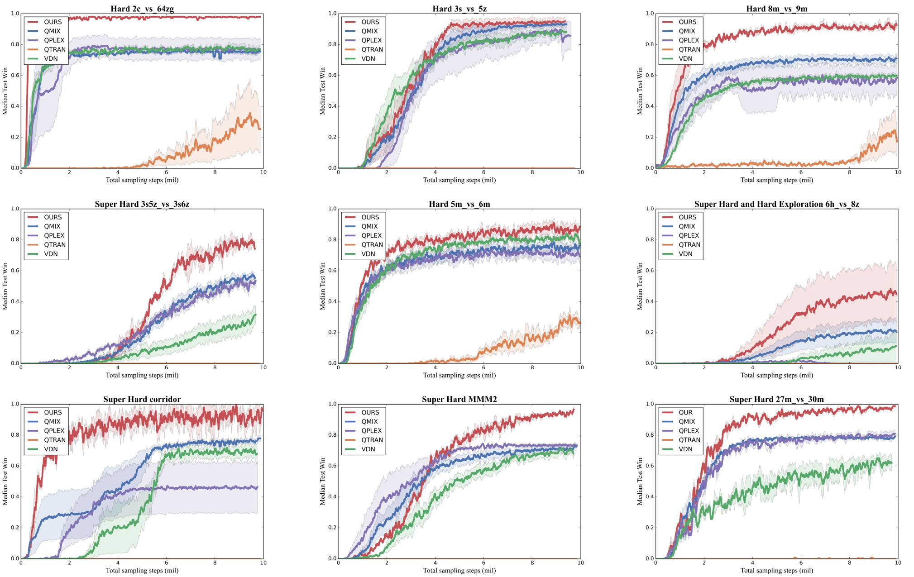

  <h1 align="center">TACT: Team-Attention-Critic Training for Multi-Agent Reinforcement Learning</h1>
  

    <a href="https://github.com/AnonymousACM/TACT" target="_blank">
        
        
        
        
        

## Introduction

In the real world, most tasks involve multiple agents, such as robot swarm control, drone swarm management, and autonomous vehicle control, all of which can be modeled as Multi-Agent Reinforcement Learning (MARL) tasks. In recent years, Multi-Agent Policy Gradient (MAPG) has achieved significant success. However, issues remain with credit assignment and learning cooperative strategies, meaning that the suboptimal behavior of certain agents can negatively impact the policy learning of other agents. While updating policies using a single critic can avoid this issue, it severely limits cooperation between agents. To address this problem, wepropose the Team-Attention-Critic Training (TACT) system for multi-agent reinforcement learning. Unlike previous methods that used either fully independent local critics or completely centralized global critics, TACT employs randomly cooperative strategy gradient computation by considering the surrounding related agents. Experiments demonstrate that our approach significantly outperforms state-of-the-art algorithms in the StarCraft Multi-Agent Challenge. Additionally, in the continuous action space benchmark environment MAMUJOCO, the agent topology can enhance agent cooperation and mitigate the centralized-distributed mismatch issue, thereby improving the overall performance of the algorithm. A video demonstration of the SMAC experimental results is available at: https://youtu.be/_PO4jOydfYw. The code will be released upon publication at: https://github.com/AnonymousACM/TACT.

## Results

